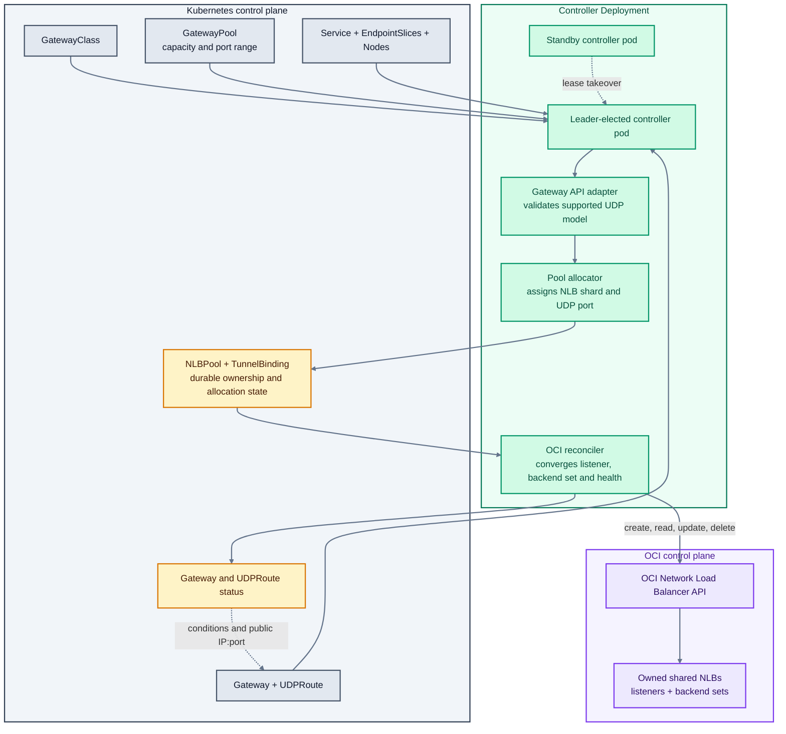

# OCI Shared NLB Gateway Controller

An experimental Kubernetes controller that lets many UDP workloads share Oracle Cloud Infrastructure (OCI) Network Load Balancers (NLBs). It implements a bounded Gateway API UDP model for Oracle Kubernetes Engine (OKE): each `UDPRoute` receives a stable public IP and UDP listener port, while multiple routes share one NLB.

> [!IMPORTANT]
> This is an independent community project. It is not an Oracle product, an OKE feature, or an Oracle-supported reference architecture. Review the code, IAM policy, limits, and validation evidence before using it. Production acceptance remains the operator's responsibility.

## What problem it solves

The OCI cloud controller normally gives a Kubernetes `Service` of type `LoadBalancer` its own load balancer. UDP tunnel platforms often need a separate public UDP endpoint for every tenant or tunnel, which can create many NLBs.

This controller changes the mapping:

```text
many UDPRoute objects -> many UDP listeners -> a smaller pool of shared OCI NLBs
```

Each route keeps its own listener, backend set, health state, and public port. The controller is only in the control path; encrypted UDP traffic flows through OCI and Kubernetes networking without passing through the controller pod.

## Recommended path for overlay clusters

Use `NodePortCluster` mode when pod addresses come from an overlay network such as Cilium:

```text
Internet peer
  -> shared OCI NLB public-IP:allocated-UDP-port
  -> OKE worker VNIC:Service-NodePort
  -> Cilium or kube-proxy service forwarding
  -> selected UDP workload pod
```

The controller registers eligible worker VNIC addresses as NLB backends. It does not assume that OCI can route directly to overlay pod IPs. Cilium kube-proxy replacement can be used when UDP NodePort handling and the worker health endpoint are configured and tested. See [Cilium overlay validation](Test/02-Cilium-Overlay-OKE-Validation.md).

> [!WARNING]
> The isolated Cilium 1.20.2 canary reproduced Oracle's published OKE issue in which deletion of a duplicate EndpointSlice can remove a still-valid Service backend. Worker `/healthz` remained a separate node-level signal and did not prove that backend existed. Treat [the recorded result](Test/02-Cilium-Overlay-OKE-Validation.md#endpointslice-backend-loss-failure) and Oracle's monitor/restart workaround as a production acceptance gate for the exact OKE and Cilium versions you operate.

`PodIP` mode is available for clusters where OCI can route from the NLB subnet directly to pod addresses. It should not be selected for an overlay network without a separately proven route.

## Architecture at a glance

```mermaid
flowchart LR
  peer[Internet UDP peer]:::external
  nlb[OCI shared NLB<br/>one listener and backend set per route]:::oci
  worker[OKE worker VNIC<br/>UDP NodePort]:::oke
  dataplane[Cilium or kube-proxy<br/>Service forwarding]:::network
  pod[UDP workload pod]:::workload
  api[Kubernetes API<br/>Gateway, UDPRoute, Service]:::k8s
  ctl[Shared NLB controller<br/>two replicas, one active leader]:::controller
  ociapi[OCI NLB API]:::oci

  peer -->|encrypted UDP| nlb -->|UDP NodePort| worker --> dataplane --> pod
  api -. desired state .-> ctl
  ctl -. reconcile .-> ociapi
  ociapi -. listener/backend state .-> nlb

  classDef external fill:#fef3c7,stroke:#d97706,color:#451a03,stroke-width:2px;
  classDef oci fill:#ede9fe,stroke:#7c3aed,color:#2e1065,stroke-width:2px;
  classDef oke fill:#e0f2fe,stroke:#0284c7,color:#0c4a6e,stroke-width:2px;
  classDef network fill:#cffafe,stroke:#0891b2,color:#164e63,stroke-width:2px;
  classDef workload fill:#dbeafe,stroke:#2563eb,color:#1e3a8a,stroke-width:2px;
  classDef k8s fill:#e2e8f0,stroke:#475569,color:#0f172a,stroke-width:2px;
  classDef controller fill:#d1fae5,stroke:#059669,color:#064e3b,stroke-width:2px;
  linkStyle default stroke:#64748b,stroke-width:2px;
```



The controller uses 45 active listener slots per NLB by default. OCI's service limit is 50; the five unused slots provide operational headroom. The value is configurable up to 50.

## Controller architecture and reconciliation



How reconciliation works:

1. The active leader watches Gateway API objects, Services, EndpointSlices, Pods, and Nodes.
2. The Gateway adapter rejects unsupported or ambiguous configurations before any OCI change.
3. The allocator assigns a durable NLB shard and listener port, then records that ownership in Kubernetes.
4. The OCI reconciler compares desired state with the tagged NLB and performs one safe asynchronous change at a time.
5. Gateway and UDPRoute status publish the assigned public IP and UDP port plus current conditions.
6. UDP packets bypass the controller. If the controller restarts, existing NLB forwarding remains while reconciliation pauses.

## Repository map

| Path | Purpose |
| --- | --- |
| `api/` | Custom resource API types |
| `cmd/controller/` | Controller executable |
| `internalcontroller/` | OCI NLB allocation and reconciliation |
| `internalgateway/` | Gateway API and UDPRoute adapter |
| `internalgatewaypool/` | Shared NLB and listener allocator |
| `deploy/` | CRDs and canonical manifests |
| `examples/` | Copy-and-adapt usage examples |
| `scripts/` | Installation, packaging, notices, and safe cleanup tools |
| `docs/` | Architecture, installation, validation, and operations |
| `Test/` | Consolidated VCN-native and Cilium overlay test evidence |
| `tests/package/` | Offline packaging and safety checks |

## Start here

1. Read the [architecture and traffic paths](docs/architecture.md).
2. Check [compatibility and limitations](docs/compatibility.md).
3. For overlay networking, complete the [Cilium validation checklist](Test/02-Cilium-Overlay-OKE-Validation.md#minimum-production-acceptance-sequence).
4. Follow [installation](docs/install.md) for a small canary.
5. Use [operations](docs/operations.md) for rollout, recovery, and retirement.
6. Review the [VCN-native](Test/01-VCN-Native-OKE-Validation.md) or [Cilium overlay](Test/02-Cilium-Overlay-OKE-Validation.md) validation report and repeat its acceptance suite in your environment.

## Build and test

```sh
go test -count=1 ./...
go vet ./...
python tests/package/test_tools.py
python scripts/collect-notices.py --check
python scripts/audit-public.py
docker build --pull=false -t oci-shared-nlb-gateway-controller:dev .
```

The Dockerfile produces a static Linux/amd64 image and runs it as an unprivileged user. Publish production images by immutable manifest digest.

## Status

Version `0.1.0` is an evaluation release. The reconciliation engine, automatic Gateway allocation, PodIP mode, and NodePortCluster mode have bounded OCI lab evidence. Cilium cross-node overlay forwarding passed its measured canary, while the EndpointSlice churn gate failed as described above. A cluster's exact CNI build, service-proxy behavior, worker health endpoint, security rules, quotas, workload behavior, and recovery objective require local acceptance testing.

See [SUPPORT.md](SUPPORT.md) and [CONTRIBUTING.md](CONTRIBUTING.md) before operating or contributing.

## License

Apache License 2.0. See [LICENSE](LICENSE) and [NOTICE](NOTICE). Third-party attributions are preserved in [THIRD_PARTY_NOTICES.json](THIRD_PARTY_NOTICES.json) and [docs/third-party-notices.md](docs/third-party-notices.md).
