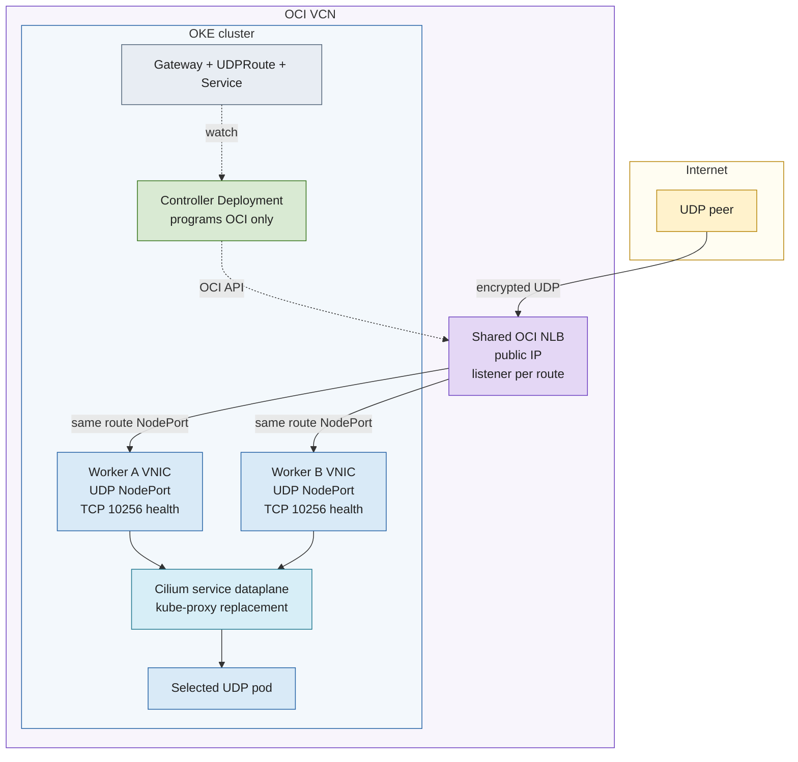

# Architecture

## Components

| Component | What it is | What it does |
| --- | --- | --- |
| Controller Deployment | Two Kubernetes pods with leader election | Watches Gateway API and Service state and reconciles OCI NLB configuration |
| `GatewayClass` | Standard cluster-scoped Gateway API object | Selects this controller through `nlb.independent.dev/native-udp` |
| `GatewayPool` | Project-specific custom resource | Defines NLB occupancy, shard count, public-port range, and worker budget |
| `Gateway` | Standard namespaced Gateway API object | Represents one OCI NLB and its UDP listeners |
| `UDPRoute` | Standard namespaced Gateway API object | Attaches one UDP Service port to one Gateway listener |
| `Service` | Standard Kubernetes object | Selects workload endpoints or reserves a NodePort |
| `NLBPool` and `TunnelBinding` | Internal custom resources | Persist cloud ownership, allocation, endpoint identity, and pending work |
| OCI NLB | Managed OCI network service | Carries UDP traffic and performs native backend health checks |

The controller is a control-plane component. It never terminates UDP sessions and does not read workload keys.

## Overlay-safe NodePortCluster path

The NLB has one listener and one backend set per `UDPRoute`. Every admitted worker is a backend for that route, using the Service's allocated NodePort. Cilium selects the actual ready pod. Worker health is HTTP `/healthz` on TCP 10256.

## Direct PodIP path

`PodIP` mode replaces worker backends with the one eligible pod IP and its UDP target port. A TCP health target must exist on the same pod. This path requires routable pod addresses from the NLB subnet and exactly one ready, non-terminating endpoint. Overlay networks normally do not meet the routability requirement.

## Allocation and capacity

- One generated `Gateway` corresponds to one OCI NLB.
- One active route consumes one NLB listener and one backend set.
- OCI permits 50 listeners/backend sets per NLB; the default pool occupancy is 45 to retain five operational slots.
- NodePortCluster creates one NLB backend per admitted worker for every active route. The controller requires `occupancy × maxWorkers <= 1024`.
- Retired ports remain tombstoned. They are not automatically reused because a former endpoint may remain cached outside the cluster.
- A newly allocated route receives the next available port from `GatewayPool.spec.portStart`.

## Ownership and failure behavior

OCI resources carry installation, pool UID, and shard tags. Cloud names derive from Kubernetes UIDs. Reconciliation refuses foreign objects and records pending OCI work. Deletion archives allocation state before finalization and retains empty NLBs for an explicit, ownership-checked cleanup step.

Stopping the controller leaves the last programmed NLB data path in place. It also stops adapting backends to worker or pod changes. Run at least two controller replicas so leader replacement does not depend on a single pod.
