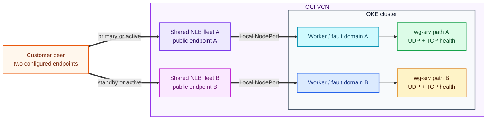

# Dual-tunnel high availability

## Goal

Give each customer two independently failing public UDP paths without returning to one NLB per customer. Path A and path B use separate controller `GatewayPool` objects, which produce separate NLB fleets. Each path selects a different tunnel pod and uses `NodePortLocal` workload health.

## Responsibilities

| Layer | Responsibility |
| --- | --- |
| Controller | Allocate two independent public IP:port endpoints, program NLB backends, and remove an unhealthy local pod/node path from service |
| Kubernetes scheduler | Keep A and B on different workers using required pod anti-affinity; spread across zones or fault domains where the node pool supports it |
| `wg-srv` | Serve UDP and an independent TCP health endpoint that reflects ability to accept tunnel traffic |
| Endpoint publisher | Publish both endpoints and their priority or health state |
| Peer/application | Establish both tunnels or fail over between them without confusing WireGuard endpoint roaming |

## Failure isolation

Two Services on one pod do not provide HA. Two pods on one worker do not cover worker loss. Two routes in one `GatewayPool` can share one NLB and do not cover NLB-path loss. The intended pattern uses:

1. two independently keyed or coordinated tunnel instances;
2. two Services with disjoint selectors;
3. required node anti-affinity;
4. two `GatewayPool` objects; and
5. application-level endpoint selection or failover.

The controller does not copy WireGuard state, decide which tunnel is active, or update the customer's peer configuration. Test those behaviors with the actual endpoint publisher and `wg-srv` implementation.

WireGuard can learn a peer's most recent authenticated source endpoint. A lab cutover observed the client roam back to the recently active canary endpoint even after an administrative endpoint reset. The retirement procedure therefore must stop traffic on the old path and verify the learned endpoint after cutover; two simultaneously active endpoints with the same key are not an automatic active-standby design.

## Pilot sequence

1. Deploy path A and prove authenticated bidirectional traffic.
2. Deploy path B in the second pool and prove that its public IP differs from A.
3. Confirm the pods run on different workers and each OCI backend set contains only its pod's worker.
4. Fail the TCP health endpoint on A; verify OCI removes A and B stays usable.
5. Delete pod A and measure controller, NLB-health, scheduler, and peer recovery separately.
6. Power off worker A and repeat.
7. Exercise an NLB-path failure or controlled pool-A retirement while B carries traffic.
8. Run both paths at the planned bandwidth and packet rate.

See [the complete object example](../examples/dual-tunnel-ha.yaml). Single-path `NodePortLocal` behavior has live OCI evidence. The two-path failover design still requires live acceptance testing with the real endpoint publisher, WireGuard keys, and workload.
